<div align="center">

<!-- ```text
██╗  ██╗███████╗██████╗  █████╗
██║  ██║██╔════╝██╔══██╗██╔══██╗
███████║█████╗  ██████╔╝███████║
██╔══██║██╔══╝  ██╔══██╗██╔══██║
██║  ██║███████╗██║  ██║██║  ██║
╚═╝  ╚═╝╚══════╝╚═╝  ╚═╝╚═╝  ╚═╝

 ██████╗██╗  ██╗███████╗███╗   ██╗
██╔════╝██║  ██║██╔════╝████╗  ██║
██║     ███████║█████╗  ██╔██╗ ██║
██║     ██╔══██║██╔══╝  ██║╚██╗██║
╚██████╗██║  ██║███████╗██║ ╚████║
 ╚═════╝╚═╝  ╚═╝╚══════╝╚═╝  ╚═══╝
``` -->




<br/>

# HERA CHEN

<p align="center">
  <kbd>Video Engineer</kbd>
  &nbsp;•&nbsp;
  <kbd>Low-Latency Streaming</kbd>
  &nbsp;•&nbsp;
  <kbd>WebRTC</kbd>
  &nbsp;•&nbsp;
  <kbd>MSE</kbd>
  &nbsp;•&nbsp;
  <kbd>WebCodecs</kbd>
  &nbsp;•&nbsp;
  <kbd>WebAssembly</kbd>
  &nbsp;•&nbsp;
  <kbd>WebGL</kbd>
</p>

*Focused on browser-based video playback and low-latency streaming. I enjoy building media players and working across the entire media pipeline, from low-level playback engines to application-level streaming services.*

<br/>

[](https://www.linkedin.com/in/ting-en-chen/)
[](https://leetcode.com/u/codeblossom99/)
[](https://)
[](mailto:tina880129@gmail.com)

</div>

---

## **Tech Stack**

### Languages

<p align="center">


</p>

---

### Media & Streaming

<p align="center">


<br>


</p>

---

### Frontend

<p align="center">


<br>


</p>

---

### Backend & Database

<p align="center">


<br>


</p>

---

### Tools & Platforms

<p align="center">


<br>


</p>

---

**GitHub Stats**

<div align="center">

  
  
  

</div>


---

<div align="center">
  <i>"Logic . Curiosity. Passion."</i>
</div>